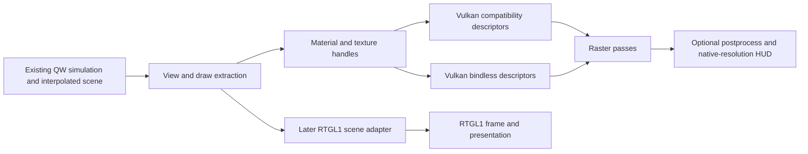

# Vulkan development implementation plan

Plan ID: PLAN-001. Revision: 2. Date: 2026-09-13.
Author and source reviewer: OpenAI Codex, at the user's request.
Status: implementation roadmap with LOCAL-007 progress recorded below.

Current RT direction (2026-09-13): the user selected direct RTGL1 integration,
with broad effect coverage and a distinct RT appearance. See
[RT-IMPLEMENTATION-PLAN.md](RT-IMPLEMENTATION-PLAN.md), RT-PLAN-002, for the active
architecture, milestones and tests. Its RT numbering supersedes section 8 below.
Raster/OpenGL appearance parity and native ray-query shadows are not prerequisites.
The remaining raster work packages remain recorded here as separate future work.

LOCAL-008 is a separate user-requested gameplay update: latest KTX master plus
three independent QuakeC fixes, documented in QUAKEC-MERGE.md. It does not change
the Vulkan work packages or constitute rerelease engine/content compatibility.

LOCAL-007 completed the first correctness/parity subset: checked hardware limits;
128-byte world and 68-byte sprite push blocks; shared world ABI; explicit failure
when required bindless capabilities are absent; NPOT reporting; skybox dimensions;
and GLM-equivalent normal-dependent alias lighting. The chosen world solution
packs existing byte-valued tints and flags, preserving the 128-byte baseline
without the larger UBO redesign proposed later in this roadmap. Runtime tests
also required screenshot transfer-source usage and safe QTV worker shutdown.

Debug/Release, 13 C/SPIR-V layouts, 22 shader modules, 1,094 mipmap cases, 42 skybox
GPU cases and 511 alias GPU comparisons passed. E1M1 runs, OpenGL comparison and
Vulkan vid_restart passed. These complete only the relevant subset of VK-01,
VK-02 and VIS-01; bounded alias fallback, resource retirement, world bindless,
new Vulkan facilities and RT remain future work. See VALIDATION.md and attribution
CODE-005 through CODE-010. The source observations in section 2 describe the pinned
base, not the corrected working tree.

CV-001 adds the working Competitive Visuals menu, material/lighting/rim controls,
world contact AO, conservative bright-pixel bloom and scene tone/exposure/sharpening.
The scene remains 8-bit and model shadows remain projected: the HDR/emissive,
dynamic-shadow and temporal work packages below are not completed by these controls.
See COMPETITIVE-VISUALS.md for the exact scope, UBO lifetime and acceptance evidence.

Base: tibazera/ezquake-source, feature/sdl3-vulkan-pr,
`91859a996daede0df166e2a55a5f08d56b052b21`, local `dev/tibazera-vulkan`.
The existing Vulkan renderer, SDL3 port and their fixes are inherited work.
See [ATTRIBUTION.md](ATTRIBUTION.md) and [DEVELOPMENT.md](DEVELOPMENT.md).

## 1. Intended outcome and priorities

Deliver a reliable Vulkan ezQuake client with explicit hardware fallbacks, lower
CPU submission overhead and optional visual enhancements using existing game
assets. Continue tibazera's implementation rather than rebuilding a renderer from
vkQuake. Treat RTGL1 as a later integration project sharing scene/material data.

The priorities are: correctness and QuakeWorld behaviour; OpenGL feature parity;
measured performance; optional enhanced visuals; then RT. New Vulkan API features
are tools for those outcomes, not release requirements in themselves.

Preserve original maps, models and textures. Existing normal/bump-map packs can
be supported as optional inputs; creating another bump-map pack is not part of
this plan. Geometric normals, lightmaps, palette fullbright information and dynamic
lights already provide useful inputs without modifying a PAK. Optional material
metadata must have safe defaults when absent.

Keep the current gameplay/network/simulation path. Respect existing ruleset gates
for visual settings. Enhanced lighting and temporal effects are individually
switchable; the low-latency configuration retains predictable original visibility.
Windows x64 is the first delivery platform, followed by Linux Vulkan validation.
Android/macOS are not included in the initial acceptance claim.

## 2. Evidence from the pinned source

At initial planning the Debug build had passed, but gameplay, visual parity and
performance had not been validated locally. Historical diary claims are not new
local test results. See the revision-2 progress note for subsequent verification.

| Area | Observed implementation | Consequence |
|---|---|---|
| API/device | `vk_instance.c`: requests Vulkan 1.2; `VK_CreateLogicalDevice` in `vk_physical_devices.c` queries five descriptor-indexing bits | Vulkan version alone does not establish renderer support |
| Alias models | `VK_AliasCreatePipeline` in `vk_aliasmodel.c` requires the bindless layout; `vk_alias_model.frag` has runtime sampler arrays | There is no working legacy alias shader fallback, despite older comments suggesting one |
| Texture table | `VK_TextureEnsureBindlessInfrastructure` in `vk_texture.c`: two fixed arrays of MAX_GLTEXTURES combined image samplers; MAX_GLTEXTURES is 8192 | Account for 16384 descriptors per table, both samplers and sampled images; validate limits before allocation |
| Feature gate | Variable descriptor count is required by the device test, but the table allocation does not use variable-count binding/allocation flags | Remove unnecessary requirements only after checking emitted shader capabilities and all consumers |
| World draws | `vk_world.c`: separate textured/lightmapped/alpha/flat/overlay pipelines; up to four descriptor sets and one direct indexed draw per item | World bindless work is still real work; it does not automatically reduce draw count |
| Shader ABI | `vk_world_push_t` is 176 bytes; world variants have had mismatched offsets | Replace the oversized common block and validate C/GLSL layouts before adding fields |
| Texture lifetime | `vk_texture.c` has deferred upload/free/refresh arrays and multiple device-idle waits | Audit in-flight and recorded-but-unsubmitted references; table indexing does not solve lifetime |
| Buffers | `vk_buffers.c` already uses staged device-local static data and prefers coherent host-visible/device-local memory for dynamic data | Measure alternatives and add retirement/suballocation; do not list this existing policy as a new feature |
| Frame scheduling | `vk_main.c`: fences per frame slot; render-finished semaphores per swapchain image | Preserve this WSI separation; it is already implemented |
| Rendering targets | `vk_local.h`, `vk_renderpass.c`: MSAA, offscreen postprocess, world normal/depth targets exist; main depth can be discarded after its pass | AO, temporal reconstruction and HDR still require a deliberate target/pass design |
| Postprocess | `vk_post_process.frag`: approximate FXAA and gamma/contrast/tint | Full parity and a linear HDR scene path are separate tasks |
| Model lighting | `vk_alias_model.vert`: forwards constant colour; GLM shader applies shade/ambient lighting | Restore normal-dependent lighting before adding new physical shading |
| Existing optimizations | Persistent pipeline cache, timerefresh GPU timestamps and optional vendor latency code already exist | Extend and test them; no claim that these will be introduced from scratch |

The source search did not find a timeline/sync2/dynamic-rendering/indirect-draw
implementation in the vk_* paths. This is a targeted planning review, not an
exhaustive engine audit. Source comments claiming a universal memory-performance
benefit or that UPDATE_AFTER_BIND eliminates lifetime hazards are not accepted
as proof.

Source entry points: [world](ezquake-vulkan/src/vk_world.c),
[textures](ezquake-vulkan/src/vk_texture.c), [device](ezquake-vulkan/src/vk_physical_devices.c),
[frame loop](ezquake-vulkan/src/vk_main.c), [alias models](ezquake-vulkan/src/vk_aliasmodel.c),
[render passes](ezquake-vulkan/src/vk_renderpass.c), [build](ezquake-vulkan/CMakeLists.txt).

## 3. Capability policy and new Vulkan facilities

Retain Vulkan 1.2 as the proposed compatibility baseline. Do not require a newer
API merely because the development SDK is new. Query and enable the exact
features, limits and formats used by each selected path. This distinction follows
[Khronos capability guidance](https://docs.vulkan.org/guide/latest/querying_extensions_features.html).

| Facility | Planned use | Gate and fallback | Priority |
|---|---|---|---|
| Descriptor indexing | Bindless world materials and unified model/world texture access | Exact indexing bits, shader capabilities and table limits; bounded descriptor variant | Core project work |
| Timeline semaphores | Track completed submissions, uploads and retirement | Vulkan 1.2 timelineSemaphore feature; fence serial fallback | After lifetime audit |
| Synchronization2 | Central, explicit barriers and submit descriptions | Vulkan 1.3 feature or KHR extension plus feature/entry points; legacy lowering | After legacy path is correct |
| Dynamic rendering | Simplify adding scene, AO and postprocess passes | Vulkan 1.3 feature or KHR extension plus feature/entry points; render-pass backend | Optional, not a visual-feature prerequisite |
| Multi-draw indirect | Batch compatible opaque world draws | multiDrawIndirect, command count limits and selected shader draw-ID scheme; direct draws | Only after CPU profiling |
| Compute culling / indirect count | Optional further reduction of draw preparation | Compute support and chosen indirect-count feature; CPU PVS/frustum path | Deferred experiment |
| Buffer device address | RT/native GPU work only if needed | Feature plus required buffer/allocation flags; SSBO indices for raster | No initial raster dependency |
| Host image copy | Optional texture-upload experiment | Host-copy feature and format support; staged transfer | Deferred measurement |
| Mesh shaders / descriptor buffers / shader objects | Possible future experiments | Individual capabilities; current pipelines remain | Outside first releases |

For the Vulkan 1.2 baseline, portable push constants must fit within 128 bytes.
Vulkan 1.4 raises the guaranteed minimum to 256, but raising the engine baseline
would unnecessarily exclude the current class of test device. Check every pipeline
against the device's actual limit, even after reducing the common block.
[Khronos limits](https://docs.vulkan.org/spec/latest/chapters/limits.html).

The initial probe reports Vulkan 1.2.188 and no required RT extensions. Later
LOCAL-007 runtime checks confirmed the indexing features/table limits used by
this renderer and a 128-byte push limit. Proposed future features and the
complete game's resource requirements still need their own capability checks.

## 4. Target data and ownership model

Introduce these concepts within the Vulkan backend first. Do not turn every
shared renderer interface into a new engine-wide abstraction in one change.
Names below are proposed, not existing APIs.

```c
/* CPU handle: a stale slot cannot silently refer to a new texture. */
typedef struct {
    uint32_t slot;
    uint32_t generation;
} vk_texture_handle_t;

/* Small common push block; verify offsets and size in the shader build. */
typedef struct {
    uint32_t draw_index;
    uint32_t view_index;
    uint32_t flags;
    uint32_t reserved;
} vk_draw_push_t; /* 16 bytes */

/* Conceptual shader-facing storage; explicit padding/strides are required. */
/* ViewData: view/projection matrices, camera/time, viewport, palette/tint state. */
/* DrawData: model matrix, colour, interpolation, material ID, geometry flags. */
/* MaterialData: base/lightmap/detail/caustic/overlay/sky texture indices. */
```

Target set 0 holds texture descriptors. In bindless mode it retains two sampler
variants; in compatibility mode it holds a bounded material texture bundle.
Target set 1 holds a view UBO plus draw/material SSBOs. The same semantic shader
inputs serve both modes. Do not add a fifth set to the existing four-set world
layout: migrate a complete world pipeline's descriptors and parameter block
together. The final design uses at most two sets for ordinary world/model draws.

Use std140 for the view UBO and std430 for storage buffers, without relying on
optional scalar block layout. Generate shared constants and assert offsets/strides
against SPIR-V reflection. Convert floating-point texture identifiers to uints.
Keep the 16-byte draw push block independent of material growth.

Each frame slot owns its command recording state, upload/draw slices, descriptor
snapshot and completion token. Each view has separate view data and later separate
temporal history. Each swapchain image retains its presentation semaphore.
Frame slot, view ID, game entity ID and swapchain image index are distinct values.



## 5. Foundation work packages

### VK-01 — Reproducible runtime baseline and measurements

Files: existing build scripts and CMake presets; add test runner/config fixtures
under a new tests/vulkan area; instrumentation in vk_main.c/vk_debug.c.

Build Debug and Release for Vulkan plus both OpenGL backends. Add Vulkan-only and
OpenGL-only configurations to catch accidental shared build dependencies. Preserve
shader compiler versions, source commit, device/driver, cvars, resolution and demo
hash with every result. Store game-data paths outside committed test fixtures.
Use the same fork's OpenGL renderer for the primary parity comparison; use the
older separate checkout to diagnose upstream/shared changes.

Create a deterministic capture recipe with fixed demo tick, camera, FOV, gamma,
resolution and animation/random state where controllable. Include original maps,
water, doors, alias models, MD3, sprites, particles, coloured skins, light styles,
HUD and multiview. Test ruleset-sensitive visuals in permitted demo/local modes.
If a test map/demo is unavailable, record it as unavailable rather than passed.

Add per-frame CPU timings (scene extraction, draw preparation, recording, waits),
GPU pass timings, draw/bind counts, upload bytes, allocation counts and explicit
idle-wait counters. Reuse the timestamp infrastructure, but read queries only
after completion; query availability, timestampPeriod and timestampValidBits must
be respected. Keep CPU and GPU times separate.

Acceptance: one reproducible demo/capture run, restart/map cycles and recorded
validation output. Debug validation and Release performance are separate runs.
Performance recipe: two warm-ups and at least five measured 60-second runs; report
median, p95/p99 frame time and run-to-run spread. TimeRefresh alone is insufficient.

### VK-02 — Capabilities, shader ABI and functioning fallback

Files: vk_instance.c, vk_physical_devices.c, vk_local.h, vk_world.c,
vk_aliasmodel.c, Vulkan shaders and CMakeLists.txt; proposed vk_caps.c/.h and
vk_shader_layout.h. Depends on VK-01 fixtures.

Create one capability report with supported, enabled and selected-path fields and
human-readable rejection reasons. Replace fixed extension-name array capacities
with bounds-checked construction before adding features. Check device API version,
queue support, sampled/renderable formats, descriptor limits, buffer alignment and
push-constant ranges. Include injected capability masks for testing fallback paths;
such tests supplement actual hardware, not certify missing hardware behaviour.

Audit all shader-required SPIR-V capabilities against enabled feature bits,
including dynamic sampled-image array indexing. The current five-bit bindless gate
is not automatically the correct minimal contract. Fixed descriptor arrays do not
need variable descriptor-count allocation. Do not require that bit merely because
runtime arrays exist in GLSL.

Implement a bounded alias fragment shader variant and matching layout. Factor
shared lighting logic into an include to avoid maintaining divergent shaders.
Select the variant before pipeline creation. Unsupported devices must get a valid
complete fallback or a clear initialization failure with an OpenGL option, never
silently missing models.

Replace world parameters with the view/draw/material model in section 4, migrating
one complete pipeline at a time. Add shader layout checks for every migrated
variant. Enforce limits before creating pipelines; the common block target is
16 bytes. Test floor/wall colours and all drawflat modes because prior layout
mismatches have caused visible regressions.

Acceptance: models/world render with descriptor indexing forcibly disabled;
all layouts pass reflection and device-limit checks; OpenGL still builds/runs.
Do not advertise baseline hardware support until both variant and device tests pass.

### VK-03 — Resource lifetime and bounded frame state

Files: vk_texture.c, vk_buffers.c, vk_resources.c, vk_main.c, vk_lightmaps.c;
proposed vk_retire.c/.h. Depends on VK-01; coordinate handles with VK-02.

First write invariants for recorded, submitted and completed work. A resource can
be referenced by a command buffer that has not been submitted; vkDeviceWaitIdle
does not finish that recording. Track recording references and convert them to
submission references at submit; release pins on aborted recording as well.

Use monotonic submission serials backed initially by existing fences. Retirement
queues hold old buffers, images, views, descriptors and sampler references until
all recorded/submitted uses are gone. Replacement creates a new version instead
of destroying the object currently referenced by a draw. Recycled texture slots
increment generation; resolve CPU handles before writing GPU draw tables.

Use per-frame descriptor-table snapshots as the initial robust policy. Update only
the reusable slot after its completion wait and before recording its draws.
Do not recycle a table index until every snapshot and recorded draw using its old
meaning has retired. Keep the old image/view alive until those references finish.
Resource replacement and shader-visible slot identity are separate problems.

For persistent texture contents such as lightmaps, retirement alone is insufficient:
order writes after old readers, or version the backing image. Coalesce dirty
rectangles and update before the new frame samples them. Mid-frame requests are
queued; define when they become visible and use explicit fallbacks for new textures.
Queue overflow must grow or fail safely; it must not bypass lifetime rules.

UPDATE_AFTER_BIND permits specific descriptor update patterns; it is not permission
to overwrite a descriptor actively used by pending work or destroy its image.
The plan deliberately uses safe snapshots before considering a shared mutable
array. [Descriptor binding rules](https://docs.vulkan.org/refpages/latest/refpages/source/VkDescriptorBindingFlagBits.html).

Acceptance: repeated skin reload, filter/aniso changes, texture slot reuse, map
changes and vid_restart with multiple frames in flight; no lifetime validation
errors, stale textures or growing allocation count. Exercise queue-overflow and
aborted-frame paths. Removing idle waits is allowed only after their protection
is replaced. Shutdown/recreation may retain explicit idle waits initially.

### VK-04 — Timeline completion and synchronization2

Files: vk_main.c, vk_resources.c, vk_texture.c, vk_renderpass.c, vk_physical_devices.c;
proposed vk_sync.c/.h. Depends on VK-03.

Add a graphics submission timeline when timelineSemaphore is supported. Signal a
new serial for each submission; retire resources using completed values. The
fence-based serial implementation remains the fallback. Start with one graphics
queue; transfer-queue ownership adds complexity and is a later measured option.
Keep binary acquire/present synchronization for WSI.
[Khronos timeline sample](https://docs.vulkan.org/samples/latest/samples/extensions/timeline_semaphore/README.html).

Preserve the current per-image render-finished semaphores. A graphics fence alone
does not establish presentation completion. Reacquisition or an appropriate WSI
completion mechanism governs reuse. Also audit screenshot acquisition/presentation
and swapchain teardown rather than assuming frame-submit completion covers them.
[Khronos WSI guidance](https://docs.vulkan.org/guide/latest/swapchain_semaphore_reuse.html).

Represent resource transitions with resource/subresource, old/new usage, stages,
accesses, layout and queue ownership. Lower that representation either to
vkCmdPipelineBarrier2/vkQueueSubmit2 or legacy calls. Account for upload-to-sample,
colour/depth-to-sample, compute-write-to-indirect-read, readback and present.
Synchronization2 makes the expression clearer; it does not infer dependencies.
[Khronos synchronization2 guide](https://docs.vulkan.org/guide/latest/extensions/VK_KHR_synchronization2.html).

Reset a frame fence only on a path guaranteed to submit; test acquire timeout,
minimize/zero extent, out-of-date and surface loss. Log outstanding serials and
states on failure so timedemo/vsync hangs have useful evidence.

Acceptance: equivalent captures and clean synchronization validation on legacy
and modern paths; resize/fullscreen/minimize/restart loop, vsync 0/1/adaptive,
screenshot and timedemo cases pass. No mandatory Vulkan 1.3 dependency is added.

## 6. New Vulkan rendering and performance work

### VK-05 — World bindless rendering

Files: vk_world.c, vk_texture.c, vk_aliasmodel.c, vk_local.h,
vulkan_shaders/vk_world_*.{vert,frag}; proposed shared material shader include.
Depends on VK-02 and VK-03. Timeline/sync2 are not prerequisites for a correct
fence-backed version.

Use the same two sampler variants as existing alias rendering, now with safe
frame snapshots. Map base texture, lightmap, detail, caustic and overlay references
to indices; represent sky faces/layers explicitly. White, black, neutral normal
and missing-texture fallbacks must be valid descriptors, not unbound slots that a
shader may accidentally sample. Validate indices before upload.

Choose capacity from actual limits and scene demand. With two arrays of N combined
image samplers, count 2N samplers and images per table; account for every live frame
table when budgeting update-after-bind pools. Check per-stage, per-set and pool
limits, including resources in other sets. If the scene does not fit, select the
bounded path or add an explicitly managed paging design later; do not clamp IDs
and render wrong textures. If using update-after-bind, query the corresponding
[indexing limits](https://docs.vulkan.org/refpages/latest/refpages/source/VkPhysicalDeviceDescriptorIndexingProperties.html).

Migrate in small reviewable slices: textured opaque; lightmapped; alpha-tested;
alpha-blended; flat/sky; overlays. Preserve alpha ordering and the existing handling
of turbulent water, floor/wall tint, fullbright/luma, detail and underwater flags.
A mixed old/new implementation must invalidate cached pipeline/layout/set state
at every boundary. Never reuse a descriptor-bind cache across incompatible layouts.

Bind shared texture/frame data once per compatible pipeline group. Direct draws
still carry a draw index; do not advertise one draw for the whole map. Keep indices
dynamically uniform per draw where proven. Use nonuniformEXT when an index can
vary across invocations; verify the generated capabilities and implicit-LOD
requirements. Do not copy the alias shader's uniformity assumption into arbitrary
future GPU batches. [Khronos indexing guide](https://docs.vulkan.org/guide/latest/extensions/VK_EXT_descriptor_indexing.html).

Proposed diagnostic control: r_vk_bindless=-1 auto, 0 bounded, 1 required. This is
a new proposed cvar, not a current command. Required mode reports unsupported
capabilities at initialization. Mode changes initially require vid_restart.

Acceptance: identical scene semantics across bounded and bindless variants;
no missing models on the bounded path; explicit table-limit tests; lower descriptor
bind/update counts on representative maps. Performance claims require VK-01 data.
Retain both modes until hardware coverage justifies changing support policy.

### VK-06 — Upload arena, allocation policy and lightmap updates

Files: vk_buffers.c, vk_resources.c, vk_texture.c, vk_lightmaps.c;
proposed vk_upload.c/.h. Depends on VK-03, may use VK-04 when available.

Create a persistent mapped staging/upload ring with completion-tagged slices.
Batch buffer/image copies before consumers rather than submitting and waiting for
each texture. Align offsets to resource/copy requirements and flush non-coherent
mapped ranges with nonCoherentAtomSize alignment. Readback uses invalidation when
required. A ring slice cannot be overwritten until the GPU has finished using it.
[Mapped-memory guidance](https://gpuopen-librariesandsdks.github.io/VulkanMemoryAllocator/html/memory_mapping.html).

Keep static BSP vertices device-local. Benchmark the existing coherent combined
heap against staging for large frequently read dynamic buffers; integrated and
discrete devices have different costs. Add allocation/budget telemetry and buffer
suballocation. Introduce VMA only through a small C-facing wrapper if allocation
fragmentation/maintenance warrants it; pin its version and keep that dependency
change separate from shader or draw changes.

Coalesce lightmap dirty rectangles per atlas page. Use transfer barriers or
versioned pages, preserving styles and dynamic lights. Do not silently delay a
lightstyle indefinitely just because the upload budget was exhausted. Bound the
queue, prioritize visible lightmaps and report deferred data.

Acceptance: no per-texture queue-idle operation during ordinary streaming;
correct texture/lightmap updates and bounded allocations after repeated maps;
report upload bytes, submissions, stalls and p99 frame time on UMA and discrete
hardware. An allocation optimization is not accepted from average FPS alone.

### VK-07 — Indirect opaque batches, then optional GPU culling

Files: vk_world.c, vk_buffers.c, vk_physical_devices.c and world shaders;
proposed vk_world_batches.c. Depends on VK-05 and VK-06; profiling must show useful
CPU submission cost before implementation.

First retain CPU BSP/PVS/frustum visibility and construct indirect command arrays
on the CPU. Group only opaque draws sharing pipeline, vertex/index buffers and
render state. Each command references its own DrawData/material; pushing a new
constant between subdraws of one indirect call is impossible.

Use gl_DrawID plus a batch base when shaderDrawParameters is enabled, and forward
the draw ID flat from vertex to fragment as needed. Query/enable multiDrawIndirect
and obey maxDrawIndirectCount. If instead using a nonzero firstInstance scheme,
require the matching drawIndirectFirstInstance support. The fallback emits direct
draws with explicit draw_index. Test the selected shader indexing scheme on each
backend; the API call itself does not supply material semantics.
[Khronos indirect drawing](https://docs.vulkan.org/samples/latest/samples/performance/multi_draw_indirect/README.html).

Only after measurable benefit, experiment with GPU frustum culling of the CPU's
PVS candidate list. Set instanceCount to zero for culled draws initially; compact
commands and use indirect-count only if justified. A compute producer needs
compute-write to indirect-read barriers and separate shader-read dependencies for
its draw data. Do not add occlusion readback stalls or reorder translucent surfaces.
Quake's modest geometry and effective BSP visibility may make this experiment a net loss.

Acceptance: geometry/culling parity, zero new validation errors and repeatable
CPU improvement with no material GPU regression. Keep direct mode if results are
within noise. Full GPU-driven visibility is outside the initial release.

### VK-08 — Explicit pass resources and optional dynamic rendering

Files: vk_renderpass.c, vk_swapchain.c, vk_main.c, vk_draw.c, vk_world.c,
vk_graphics_pipeline.c; proposed vk_passes.c/.h. Depends on VK-02/03 and VK-04's
transition model, but can retain legacy barrier lowering.

Introduce a small pass/resource description: colour/depth formats, sample counts,
load/store operations, extent, view, inputs, outputs and resource lifetime. Avoid
a general-purpose graph compiler initially. Centralize resource creation and
recreation so adding AO/HDR does not scatter swapchain-index assumptions.

Legacy VkRenderPass remains the compatibility executor. Add dynamic rendering as
an optional executor using matching VkPipelineRenderingCreateInfo formats and
explicit attachment transitions. Migrate a simple postprocess pass first, then
world/normal passes. Pipeline cache keys must include executor, format, samples
and shader/layout variant. Dynamic rendering does not replace pipeline objects,
barriers or lifetime management.
[Khronos dynamic rendering sample](https://docs.vulkan.org/samples/latest/samples/extensions/dynamic_rendering/README.html).

Make depth/normal images per frame slot or otherwise prove non-overlap for every
reader. Existing shared main depth is not automatically suitable for postprocess
sampling with frames in flight. Store depth when it will be read; validate sampled
usage/format and layout transitions. Define MSAA depth/normal resolve semantics
instead of averaging samples blindly. Initially disable incompatible effect/MSAA
combinations with a clear configuration result until that resolve is implemented.

Acceptance: executor A/B captures, recreation with changed size/MSAA, multiview
isolation, and synchronization-clean reads of stored depth/normals. Visual features
below must remain possible on the legacy executor.

### VK-09 — Pipeline preparation and latency diagnostics

Files: vk_physical_devices.c (existing cache), pipeline creators, vk_main.c,
vk_sdl.c. Depends on VK-01 and affected shader variants.

Keep current persisted pipeline caching. Add variant-key/version tracking and a
bounded warm-up list for selected presets; collect first-use pipeline creation
stalls. Treat incompatible cache data as a miss. Background compilation, if later
introduced, needs explicit cache/thread synchronization and lifetime ownership.
Do not multiply variants for every boolean when a uniform is sufficient.

Audit existing AMD/NVIDIA latency paths against the device feature and semaphore
requirements; source comments alone are not evidence. Device-creation opt-in and
runtime cvar behaviour must agree. Measure CPU queueing and presentation separately;
end-to-end input latency needs suitable instrumentation, not an FPS inference.
Do not alter QuakeWorld simulation tick or packet cadence to improve a graphics metric.

Acceptance: cold/warm cache comparison, unsupported-vendor paths, enabling/disabling
options across restart, and recorded frame-pacing behaviour. New vendor dependencies
remain optional. Frame generation is not proposed for the competitive configuration.

## 7. Visual development using existing assets

The proposed default compatibility appearance remains available. Enhanced effects
are independent options, subject to existing ruleset policy. A Vulkan API upgrade
alone does not produce these effects.

### VIS-01 — Restore and document OpenGL parity

Files: vk_aliasmodel.c, vk_md3.c, alias shaders, vk_world.c/world shaders,
r_texture_load.c capability entry point, vk_draw.c/postprocess shader.
Depends on VK-01/02; lifetime-sensitive changes use VK-03.

Carry normal/ambient/shade inputs to alias shaders and reproduce the GLM lighting
formula before proposing a new one. Define frame-interpolated normal behaviour,
normalization, weapon handling and player-colour/fullbright masks. Verify model
formats separately; do not assume the MD3 path has identical inputs.

Resolve NPOT reporting by tracing initialization through the shared texture loader,
then test 3x5, 257x129 and 1xN generated textures, mip extents down to 1, filtering,
wrap/clamp and sky seams. Replace fixed skybox half-texel limits with actual
textureSize-derived bounds. Texture format blit/filter capability determines the
mipmap path; provide a valid CPU/compute alternative when a linear blit is absent.

Port the existing shared FXAA algorithm/settings semantics where feasible; retain
its notices. Compare gamma, contrast, damage tint, underwater behaviour and HUD
ordering against GL rather than assuming a mathematically cleaner path is parity.
Retest previously reported drawflat, caustic, outline and screenshot fixes.

Acceptance: signed-off reference images by feature, with numerical image metrics
as assistance rather than a substitute for inspection. Separate intentional
appearance changes from regressions. Existing effects are not credited as new work.

### VIS-02 — Linear HDR scene, controlled tonemapping and bloom

Files: pass/target layer, vk_renderpass.c, vk_draw.c, world/model shaders;
proposed vk_hdr.c and tone-map/bloom shaders. Depends on VK-08 and VIS-01.

Add an optional linear scene-colour target, preferring RGBA16F when its required
attachment/sample capabilities exist. Audit palette textures, external textures,
lightmaps and emissive masks separately for colour-space treatment. Convert each
input exactly once; do not apply sRGB decoding to lightmaps without establishing
their encoding. Keep the compatibility shading path independently selectable.

Accumulate chosen enhanced lighting/emission in linear space. Use manual exposure
first for stable play; automatic exposure is an optional later setting with clamped
adaptation. Add a selectable tone curve, then a thresholded downsample/upsample
bloom chain using existing fullbright/emissive signals. Bloom is a screen-space
appearance effect, not illumination of surrounding geometry.

Pipeline order: opaque and transparent scene -> optional temporal reconstruction
at scene resolution -> bloom -> tone mapping -> non-temporal AA if selected ->
HUD/console at output resolution -> presentation conversion. Preserve established
palette/tint semantics through explicit compatibility composition. Never blur or
jitter the crosshair/UI accidentally.

This phase targets SDR output from an HDR internal buffer. HDR10/scRGB monitor
output needs separate surface colour-space negotiation, output transfer function,
metadata/UI brightness and monitor testing; it is a later item.

Acceptance: no double gamma, controlled highlights, readable original textures,
no HUD bloom, correct screenshots and stable results on brightness transitions.
Measure memory/bandwidth cost before enabling by default on integrated graphics.

### VIS-03 — Screen-space contact shading / ambient occlusion

Files: pass layer, normal/depth shader paths; proposed vk_ao.c and AO shaders.
Depends on VK-08 and VIS-01; integrate into the linear path when VIS-02 is selected.

Start with a non-temporal half-resolution AO prototype and depth-aware filtering.
Use existing world geometric normals, then add model normals if models should
participate. Reconstruct positions with the actual Vulkan projection, depth range
and reversed-depth setting. Exclude sky; define weapon and transparent-surface
handling explicitly. Do not use the world-only outline normals as if they include
all objects.

Evaluate a pinned CACAO integration against the simpler prototype if quality and
maintenance justify the dependency. CACAO derives obscurance from depth/normal
inputs; it does not recover unseen scene geometry.
[AMD CACAO documentation](https://gpuopen.com/manuals/fidelityfx_sdk/techniques/combined-adaptive-compute-ambient-occlusion/).

Apply a restrained factor to the intended ambient component. Quake's baked
lightmaps already contain shadows, so avoid multiplying all lighting/emission and
making corners excessively dark. Keep radius/intensity controls and a neutral
zero-strength path. Add temporal accumulation only after VIS-06's history contract.

Acceptance: no edge halos, camera-dependent dark flashes, UI shading or wall
visibility changes; compare stills and motion in narrow corridors and open areas.
Profile low/medium quality on the integrated device before choosing defaults.

### VIS-04 — Dynamic lights and raster shadow maps

Files: vk_lightmaps.c, scene extraction, material/world/model shaders;
proposed vk_lights.c and vk_shadows.c. Depends on VK-08 and VIS-01; HDR path preferred.

Extract existing dynamic lights into a view light buffer. Start with a bounded
forward loop; only add tiled/clustered light lists after a many-light benchmark
shows the need. Preserve lightstyle animation. For lights handled by the enhanced
shader, disable their duplicate contribution in dynamic lightmaps for that mode.

Add one shadow-casting light first, including BSP and moving brush/model occluders.
Then budget a small number of point/spot lights using an atlas or cube faces as
appropriate, with stable selection/hysteresis, update budget, bias and PCF filtering.
Handle alpha-tested occluders and avoid baking the weapon into world shadows.
Static lightmap shadows cannot be undone or reliably decomposed into original
light sources; do not claim full physically correct relighting of baked maps.

Acceptance: moving door and model shadows, stable light selection, no double
lighting, acne/peter-panning review and a hard per-frame shadow workload limit.
Keep original lighting for the compatibility path and ruleset-restricted modes.

### VIS-05 — Material metadata and reflection experiments

Files: texture/material mapping and shaders; proposed r_material_metadata.c with
backend-neutral data, optional material definitions outside original PAK files.
Depends on VK-05/VK-08; HDR/dynamic lights provide meaningful shading inputs.

Use explicit texture-name plus content-hash matching for optional roughness,
metalness, emission, normal/height inputs and water parameters. Unknown materials
get conservative defaults: no invented metallic surfaces or strong specular gloss.
Load existing normal maps when supplied; document tangent basis and Y convention.
Do not infer reliable physical material properties from an old diffuse texture.

For a contained water-reflection experiment, render one selected planar reflection
view at reduced resolution with clipping and a bounded update rate. Other surfaces
use the original appearance or a deliberate environment fallback. SSR is an
alternative experiment with depth thickness tests and a fallback for off-screen
or occluded samples; it cannot see absent pixels. Do not ship both first.

Acceptance: original assets still work alone; no metadata collision, reversed
normal maps, excessive water cost or recursive reflection views. Ensure added
views do not contaminate the main view's temporal history or QW visibility state.

### VIS-06 — Motion vectors, optional TAA and temporal upscaling

Files: view extraction, world/model shaders, pass layer; proposed vk_temporal.c.
Depends on stable VK-08 and VIS-01; VIS-02 supplies the preferred scene colour.

Track current/previous camera transforms and per-entity interpolated poses with
stable generation IDs. Produce motion for moving brush models, animated alias
models and the weapon, not just camera motion. Give each multiview pane independent
history, jitter, exposure and dimensions. Reset on map change, teleport, seek,
view target/FOV/resolution change, renderer restart and entity identity reuse.

First visualize and validate motion/depth/disocclusion. Then add one temporal AA
or upscaler implementation behind an option. FSR2 is a compatible candidate because
the donor already contains it, but its raster integration still needs scene colour,
depth, motion, jitter and transparent/reactive handling. Reusing a DLL does not
supply those inputs. Audit the exact pinned version and API before implementation.
[AMD FSR2 input requirements](https://gpuopen.com/fidelityfx-superresolution-2/).

Keep native-resolution MSAA/non-temporal modes for latency and clarity. Temporal
reconstruction excludes HUD/console and needs tests for particles, teleport effects,
fast strafing, model animation and weapon edges. No frame generation is required.

Acceptance: history reset fixtures, no cross-view contamination, bounded ghosting
review in motion and measured GPU cost at native and reduced scene resolutions.
A static screenshot cannot establish temporal quality.

## 8. RTGL1 integration as a separate phase

Historical proposal: superseded by [RT-PLAN-002](RT-IMPLEMENTATION-PLAN.md).
The RT-00 and subsequent identifiers below belong to PLAN-001, not the active plan.

Pinned donor: vkquake-rt `bb4a10e60998379efd5a0e9ad0bb30fab94015e8`.
Pinned library: RTGL1 quake branch `9efa82daf963e1192daaf2a8596446656f113cd2`.
Existing local Windows fixes are CODE-001 through CODE-004, not RT integration.

### RT-00 — Prove the integration boundary on supported hardware

Read [RTGL1.h](rtgl1/Include/RTGL1/RTGL1.h), its implementation and the donor's
[gl_vidsdl.c](vkquake-rt/Quake/gl_vidsdl.c) and
[gl_rmain.c](vkquake-rt/Quake/gl_rmain.c) together. RgInstanceCreateInfo takes a
native surface description; the reviewed public creation structure does not
accept ezQuake's existing VkDevice/command buffer as an injection interface.
Treat RTGL1 as owning its rendering/presentation context unless the full API audit
proves a supported interoperability mechanism. Do not call its frame path as if it
were a small postprocess pass inside the existing Vulkan command buffer.

Proposed first architecture: an optional renderer backend adapter, with mutually
exclusive raster/RT device and presentation ownership, sharing CPU scene/material
extraction and SDL3 window information. Audit renderer_api_t, r_main.c, r_renderer.h
and vk_sdl.c for shutdown/init and resource reconstruction. Reserve any numeric
renderer value only after checking all configuration/UI consumers.

Create a tiny supported-device harness that loads the pinned library and displays
known geometry with required shaders/blue-noise files. Verify the full RTGL1
feature/extension requirements, file callbacks and ABI; the two missing extensions
reported by the current probe are not its complete requirement list.

Acceptance: actual frame output on an RT-capable test device, reliable shutdown
and a written ownership decision. If this fails, keep raster development moving;
compilation on the current machine is not RT proof.

### RT-01 — Static scene and material bridge

Add proposed r_rt_scene.c/.h and rtgl1_backend.c/.h with optional CMake linkage.
Export BSP triangles, texture coordinates and material IDs at map load using the
model-space source data, not Vulkan buffer readback. Static geometry for secondary
rays must cover the required scene beyond the main raster PVS. Reuse original
texture pixels and optional material metadata. Define coordinate handedness,
units, winding, light scale, sky, water and alpha-test semantics explicitly.

Assign stable map-generation/mesh/surface identifiers. Submit static geometry once
per map version, with deterministic replacement/deletion on restart. Upload the
full static world only after checking memory requirements and RTGL1 conventions.

Acceptance: a static map renders with correct orientation, textures and scale;
map switch frees/replaces its scene; missing optional materials degrade predictably.
No asset pack rewrite is needed for the baseline.

### RT-02 — Dynamic QuakeWorld scene, lights and UI

Use the already interpolated client scene for brush and alias models. Build stable
entity+generation IDs; handle spawn, removal, model change, teleports and demo seek.
Provide previous/current transforms or deformation data as required by RTGL1.
Preserve player recolouring and emissive masks. Map dynamic lights to RTGL1 lights
with calibrated units and stable identifiers. Bridge particles, water and HUD via
its appropriate ray/raster APIs; do not assume all effects belong in ray geometry.

Explicitly test what network snapshots contain. A client cannot reflect an entity
it has never received. Define stale/disappeared entity handling rather than keeping
phantom opponents in reflections. Full unseen-player reflections would require a
separately scoped protocol/server policy decision, not a renderer-only promise.
Do not change protocol behaviour in this phase.

Acceptance: a recorded demo and local network session with moving entities/lights,
correct deletion, weapon/UI layering, map change and seek. Compare client simulation
and network behaviour with the raster path.

### RT-03 — Temporal rendering, multiple views and quality

Audit RTGL1's temporal-history ownership and support for multiple views/contexts.
An API accepting one camera per frame does not prove independent multiview history.
Start with one main view. Add multiview only after demonstrating isolated histories,
resource cost and correct viewport/UI composition; otherwise explicitly mark it
unsupported in RT while retaining it in raster.

Tune light/material defaults and denoising/upscaling inputs using motion sequences,
not still images alone. Prevent history carryover after seek, map change or camera
cut. Evaluate reflections, indirect lighting, water and emissive surfaces against
intentional reference scenes. Preserve a fast raster option.

Acceptance: quality captures, moving-camera review, history resets and reported
RT frame/memory budgets on at least the primary supported GPU. Full cross-vendor
support needs corresponding hardware runs.

### RT-04 — Packaging and release validation

Create a reproducible optional runtime bundle with the exact DLL, shader set,
configuration and required non-game resources, their sources/notices and hashes.
Original Quake data stays user-supplied. Test missing/corrupt optional resources,
unsupported GPU and switching back to raster. Add API/version mismatch diagnostics.

Keep the RTGL1 dependency optional at build and run time, with independent CI jobs
for compiling the adapter and GPU jobs for rendering. Do not call a DLL-only build
a playable RT release. Publish only when separately requested by the user.

## 9. Test and release gates

### Mandatory matrix

| Dimension | Required coverage |
|---|---|
| Build | Windows Debug/Release; Vulkan+GL, Vulkan-only, GL-only; Linux Vulkan compile/run before claiming Linux support |
| Capability | Actual local Vulkan 1.2 device; a current discrete GPU; forced bounded/bindless and legacy/modern synchronization modes; query-supported combinations only |
| Frame lifecycle | One/two supported frame-slot modes; swapchain image count differing from frame count; resize, minimize, fullscreen, alt-tab, restart, out-of-date paths |
| World/materials | Lightmapped/flat/tinted, water/lava, skybox sizes, details/caustics, alpha cutout and alpha blend, luma/fullbright, animated textures/lightstyles |
| Entities | Alias and MD3, interpolation, coloured skins, weapon, moving brush, sprites, particles, spawn/delete/reuse |
| QW behaviour | Demo playback/seek/timedemo, multiview/spectator target changes, local network session and existing ruleset restrictions |
| Postprocess | Gamma/tint/FXAA/MSAA combinations, UI order, screenshots, reversed depth, disabled-effect neutral path |
| Resources | Tiny table/ring capacity, many skin replacements, queue overflow, reload, repeated maps and bounded memory after settling |
| RT | Separate supported GPU with actual scene output; required resources/ABI; single view first; no support claim from compile-only jobs |

Start with one original-map demo and one small legally redistributable synthetic
scene for shader/lifetime tests. Expand by feature, not by repeatedly running an
unchanged enormous suite. Synthetic NPOT textures, layout fixtures and handle/queue
unit tests are useful because they expose independent correctness properties.
Avoid tests that merely duplicate implementation details.

For each graphics-changing PR: build its affected shader variants and run SPIR-V
validation, relevant C/GLSL layout checks, Debug Vulkan validation, focused visual
fixtures and Release timing when performance is claimed. Record warnings/errors
as unresolved or investigated; do not silently whitelist all existing VUIDs.
Use synchronization validation for lifetime/barrier work and GPU-assisted descriptor
validation where available; their instrumentation overhead is excluded from timings.

Suggested initial performance acceptance rule: a change advertised as faster must
beat measured run-to-run noise and avoid a repeatable >5% p95/p99 regression on the
baseline suite unless the quality/performance tradeoff is explicitly documented.
Five percent is a proposed review threshold, not a guaranteed speedup or an
empirical result. Save raw measurements; do not compare Debug to Release.

A release gate requires completed fixtures, no unresolved critical Vulkan errors,
recorded hardware limits, a tested fallback and remaining known issues. API version
strings, compiler success and automated screenshot existence are insufficient.

## 10. Work order, estimates and commit boundaries

Estimates are engineering planning ranges for one experienced graphics developer,
including focused tests and review preparation. They are not measured productivity
or calendar promises. Unknown runtime bugs, unavailable hardware and upstream
changes can expand them. Re-estimate after VK-01/02 and the first RT harness.

| Package | Dependency | Estimated developer days |
|---|---|---:|
| VK-01 runtime baseline | Game data/demo and runnable device | 3–5 |
| VK-02 capabilities/ABI/fallback | VK-01 | 6–10 |
| VK-03 resource lifetime | VK-01; coordinate with VK-02 | 8–15 |
| VIS-01 parity | VK-01/02, VK-03 for texture work | 5–10 |
| VK-05 world bindless | VK-02/03 | 8–15 |
| VK-04 timeline/sync2 | VK-03 | 4–8 |
| VK-06 upload/allocation | VK-03 | 5–10 |
| VK-08 pass resources/dynamic rendering | VK-02/03 and transition model | 6–12 |
| VK-09 cache/latency | VK-01 and variant definitions | 3–6 |
| VK-07 CPU-built indirect batches | VK-05/06 and profiling evidence | 5–10 |
| VK-07 optional compute-culling experiment | Indirect prototype and evidence | additional 5–10 |
| VIS-02 HDR/bloom to SDR | VK-08, VIS-01 | 7–12 |
| VIS-03 AO | VK-08, VIS-01 | 6–10 |
| VIS-04 dynamic lighting/shadows | VK-08, VIS-01 | 10–20 |
| VIS-05 materials/reflection prototype | VK-05/08 | 6–12 |
| VIS-06 motion/temporal reconstruction | VK-08, VIS-01; HDR preferred | 12–22 |
| RT-00 ownership/harness | Supported RT device | 3–5 |
| RT-01 static bridge | RT-00, stable scene/material data | 8–15 |
| RT-02 dynamic QW scene | RT-01 | 12–22 |
| RT-03 history/quality | RT-02 | 12–22 |
| RT-04 packaging and release | RT-01/02/03 | 8–15 |

Recommended first milestone: VK-01/02/03, VIS-01 and VK-05, approximately 30–55
developer days. This is a stable, compatible bindless raster milestone, not an
RT or complete enhanced-visual release. Timeline/sync2/upload/pass work adds
roughly 15–30 days; HDR/bloom plus AO adds roughly 13–22 days after its prerequisites.
The full RT sequence is a separate 43–79-day estimate with greater uncertainty.
These groups omit optional indirect, shadow, reflection and temporal raster work;
do not interpret them as the total for every item in this document.

The first concrete PR sequence should be:

1. **PLAN-001 / baseline evidence:** fixtures, capability report and measurement
   records, with no appearance change.
2. **VK-02a:** alias bounded shader variant and correct capability selection.
3. **VK-02b:** one world pipeline's compact parameter ABI and bounded material set;
   layout tests. Repeat for remaining pipelines without mixing unrelated effects.
4. **VK-03a:** recording/submission ownership and texture generation handles.
5. **VK-03b:** deferred destruction and per-frame texture-table snapshots; stress
   tests before removing protective waits.
6. **VIS-01a:** alias-lighting parity; separate NPOT/sky and FXAA parity PRs.
7. **VK-05a:** opaque textured/lightmapped bindless world; measured A/B result.
8. **VK-05b:** remaining world variants and full fallback regression suite.

Subsequent PRs each carry one package/subpackage ID, base commit, affected files,
implemented behaviour, source credit, validation and rollback control. Do not
squash imported upstream history into a new locally authored renderer commit.
Keep vendor imports and local adapter code distinguishable. No assignee or human
reviewer is invented; actual contributors fill these fields when work begins.

## 11. Deferred work and explicit decisions

Do not raise the minimum to Vulkan 1.4 in the first release. Dynamic rendering and
sync2 stay optional, and bindless must have a real tested fallback. Do not make a
mesh-shader rewrite, descriptor-buffer migration or a general frame-graph framework
a prerequisite for Quake rendering. Host image copy is a later upload experiment
with feature/format checks, not an assumed facility of every device.
[Khronos host-copy sample](https://docs.vulkan.org/samples/latest/samples/extensions/host_image_copy/README.html).

Replacing Speex/SpeexDSP's autotools build can be a separate BUILD-01 package
(rough estimate 3–6 days, plus any platform-specific fixes): pin a CMake-capable
source or vcpkg overlay, preserve exported targets/ABI/options, verify voice encode/
decode and clean Windows builds. It is not on the Vulkan critical path and should
not be bundled with renderer changes.

Decisions to record after evidence is available: actual baseline hardware and table
capacity; whether indirect batching earns its maintenance cost; AO implementation;
HDR output beyond SDR; temporal reconstruction version; RTGL1 multiview feasibility.
The defaults in this plan permit useful implementation without resolving every
optional graphics choice first.

## 12. Evidence and maintenance

External references linked beside the relevant API claims are primary Khronos and
AMD documentation, consulted on 2026-09-13. Proposed architecture, priorities and
effort ranges are Codex's engineering judgment, not upstream commitments. The code
review is against the locked local revision, not an assertion about future PR state.

Keep this plan, TIBAZERA-TODO.md and DEVELOPMENT.md consistent as packages land.
Change proposed status to implemented only with a real commit/patch and local test
evidence. Preserve superseded findings as dated corrections when they explain a
change of direction. Regenerate the provenance snapshot after documentation/code
changes with scripts/Export-Provenance.ps1; source and binary locks have separate
purposes and must not be presented as proof that gameplay was tested.

## CV-PLAN-001 — Competitive visual controls (2026-09-13)

The user approved the next engine sequence and requested conservative bloom,
then requested all discussed clarity/stylization options in a dedicated menu.
The menu name is Competitive Visuals. Independent controls, optional presets,
VALORANT design references and implementation gates are recorded in
[COMPETITIVE-VISUALS.md](COMPETITIVE-VISUALS.md). This is planned scope, not a
claim that the menu or new effects have been implemented. Existing PLAN-001
stability, parity and resource prerequisites remain in effect.
