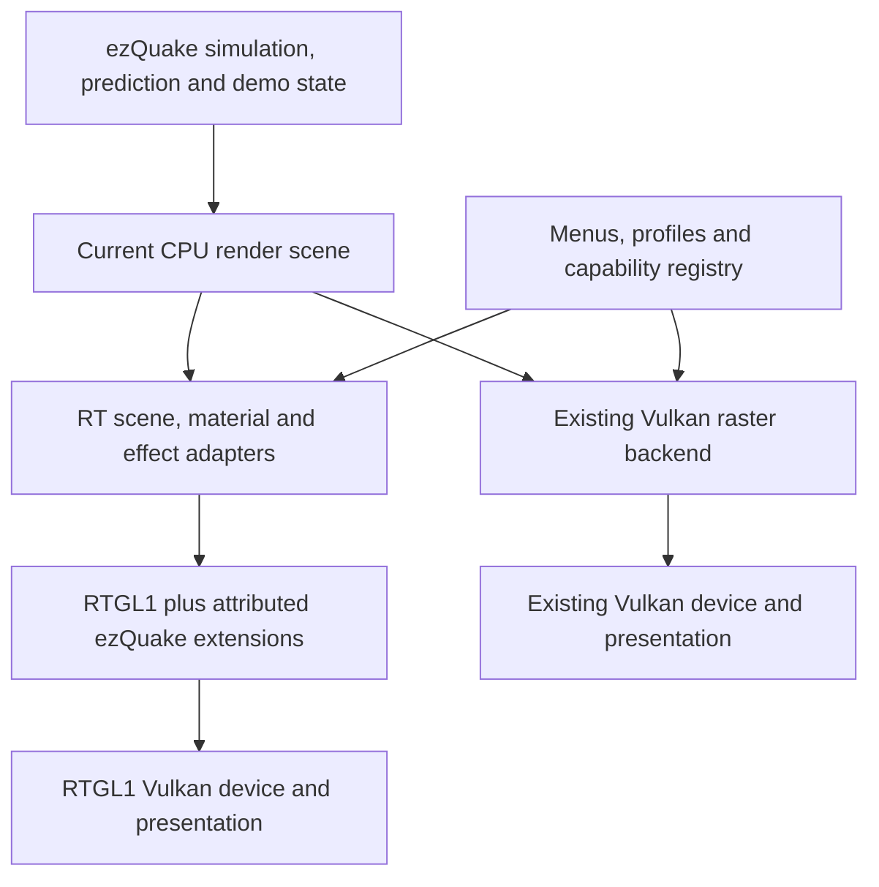

# Direct RTGL1 integration into ezQuake Vulkan

Plan: RT-PLAN-002, revision 1, 2026-09-13.
Author and source reviewer: OpenAI Codex. Scope and visual policy: the user.
Status: technical plan only; none of the implementation milestones below is complete.

## 1. Objective and accepted visual policy

Add an optional path-traced renderer to the current ezQuake fork using the
existing vkquake-rt integration and RTGL1. Bring across the existing effects,
controls and game presentation as far as their behavior can be supported.
Accept the RT renderer's own appearance and use separate RT defaults.

Correctness means that an effect works, obeys its controls, respects visibility
and rulesets, and survives normal game transitions. It does not mean matching
the raster renderer's lighting, bloom footprint, colours or pixels. Comparisons
against raster images are useful for finding missing objects, not for colour grading.

Retain ezQuake's input, prediction, networking, sound, QuakeC execution, menus,
demo support, ESDF/WASD aliases and configuration browser. The first playable RT
milestone uses one view; the subsequent effects and multiplayer milestones remain
part of the plan. This is not a proposal to stop after a static-map demonstration.

This plan supersedes the sequencing of section 8 of
[IMPLEMENTATION-PLAN.md](IMPLEMENTATION-PLAN.md). Its RT-00..08 identifiers refer
to this revision, replacing the older plan's RT numbering.
The native vkQuake ray-query shadow path is a separate possible project, not a
prerequisite. RTGL1 will provide the initial lighting, reflections, refraction,
denoising and postprocessing together.

## 2. Audited baseline and reusable work

| Component | Pinned baseline / source | Use |
|---|---|---|
| Current public ezQuake fork | bcace078b8cdbd8212bb9b16eb141f2ea9537d07 | Host engine, tested raster fallback, effects and controls |
| Inherited ezQuake Vulkan base | tibazera feature/sdl3-vulkan-pr, 91859a996daede0df166e2a55a5f08d56b052b21 | SDL3 and renderer dispatch ancestry |
| vkquake-rt | bb4a10e60998379efd5a0e9ad0bb30fab94015e8 | Reference scene/material/light conversion and presentation |
| RTGL1, quake branch | 9efa82daf963e1192daaf2a8596446656f113cd2 | Path tracer, acceleration structures, denoiser and raster overlays |

Existing local CODE-001..004 RT build fixes remain a separate, attributed patch
layer. The local DLL, donor executable and 51 shader binaries exist; that does
not establish a complete working RT runtime. Do not replace the pinned library
with its default branch: that branch has a different integration interface.

Source observations used by this plan:

- `ezquake-vulkan/src/r_renderer_structure.h` exposes world, alias, sprite, HUD,
  texture and frame operations. It also exposes VAO/framebuffer assumptions that
  a new backend must handle explicitly.
- `r_main.c` currently selects renderers 0, 1 and 2. `vid_sdl.c` creates windows,
  dispatches context initialization and handles fallback. `vk_sdl.c` alone is not
  the integration point. `r_texture.c` has direct renderer branches as well.
- `rtgl1/Include/RTGL1/RTGL1.h` accepts a native window in RgInstanceCreateInfo;
  it does not accept the existing ezQuake VkDevice/command buffer.
- `RTGL1/Source/VulkanDevice.cpp` traces and denoises, composites raster effects,
  applies postprocessing/upscaling, and then draws swapchain-resolution HUD geometry.
- RgGeometryUploadInfo has IDs, visibility classes and material defaults, but no
  dedicated ezQuake team/powerup/competitive-style metadata. That needs an extension.
- RgStartFrameInfo has VSync and shader-reload requests; it has no explicit
  history-reset request. Reset behavior must be implemented or proven in the library.
- RgDrawFrameBloomParams has intensity, threshold and emission multiplier, but no
  radius. RgDrawFrameTonemappingParams is not a drop-in match for our exposure and
  tone-curve controls. Similar labels must not be treated as identical APIs.
- Current saved profiles contain 53 visual settings plus 55 conditional VX
  settings. These are a minimum coverage list; Graphics/View menus and other
  particle cvars contain additional functionality that must also be inventoried.

Primary upstream references: [vkquake-rt](https://github.com/sultim-t/vkquake-rt),
[RTGL1 quake API](https://github.com/sultim-t/RayTracedGL1/blob/9efa82daf963e1192daaf2a8596446656f113cd2/Include/RTGL1/RTGL1.h),
[current host](https://github.com/awkinnunen/ezQuake-Vulkan).

## 3. Backend architecture and ownership

Use a new optional backend, provisionally `vid_renderer 3`, named **Vulkan RT**.
The number is a proposal until every renderer-value consumer has been audited.
Do not redefine `R_UseVulkan()` to include RT: existing callers assume ownership
of the raster Vulkan device, buffers and command stream.

Only the selected backend owns the active device/presentation lifecycle. Retain
the SDL3 window and input abstraction; expose the Windows native handles using
SDL3's documented window properties. Do not copy the donor's SDL2 initialization.

Proposed new source modules (these files do not exist yet):

| Module | Responsibility |
|---|---|
| `rt_backend.c/.h` | Renderer dispatch, init/shutdown, frame ownership, capability/error reporting |
| `rt_api.c/.h` | Load the pinned RTGL1 C ABI, validate required exports and extension ABI |
| `rt_scene.c/.h` | Static map submission, scene generation and stable object IDs |
| `rt_models.c` | Animated aliases, MD3, movable brush models and first-person geometry |
| `rt_materials.c/.h` | CPU texture sources, RT material handles, animation and player skin variants |
| `rt_lights.c` | Map lights, fullbright emission and transient effect lights |
| `rt_effects.c` | QMB/classic particles, beams, coronas, trails, decals and shell submissions |
| `rt_draw.c` | HUD, console, menus, crosshairs, viewport/scissor conversion and capture |
| `rt_settings.c/.h` | RT controls, backend capability mapping and profile activation |

Keep these C modules linked through the C ABI; keep RTGL1's C++ implementation in
its own build. Introduce only the shared CPU-scene helpers actually needed by both
backends. No broad renderer rewrite or new gameplay abstraction is required.

Audit every renderer callback and direct GL/Vulkan branch. A callback may be a
documented no-op only when the RT backend supplies its intended behavior elsewhere
(for example, baked-lightmap updates when physical lighting is selected). Missing
texture/HUD/frame implementations must never be disguised by empty callbacks.

### Lifecycle contract

1. Validate requested backend, device requirements and runtime package before
   tearing down the working backend where possible.
2. Drain the old backend's work, release backend handles, then change window/device
   ownership. Rebuild textures and scene from CPU sources rather than GPU readback.
3. Start RTGL1, restore the RT profile and rebuild map-dependent resources.
4. On initialization failure, tear down partial RT state and restore the last
   working raster backend once, with a specific error. Avoid fallback loops.
5. Resize/fullscreen events go to the active backend. On shutdown, destroy RTGL1
   before the native window and unload its DLL only after all library calls end.

Use a single submitted RT frame per presentation. Collect world geometry, dynamic
objects, effects and HUD before `rgDrawFrame`. Static uploads are bracketed by
`rgBeginStaticGeometries` / `rgSubmitStaticGeometries` outside dynamic uploads;
beginning a new static scene erases previously uploaded dynamic geometry.

## 4. Build, device validation and runtime package

Add an optional `RENDERER_RTGL1` CMake option, disabled in the ordinary build.
Provide a combined Vulkan+RT preset and keep the current Vulkan-only preset.
The executable must still launch without an RT DLL when RT is not selected.

Load a known package location, validate its manifest and resolve all required
exports before use. Record the library commit, local patch revision, headers/ABI,
shader hashes and non-game resource hashes together. Do not search arbitrary game
directories for a same-named DLL. A package mismatch is an explicit load failure.

Preflight all device extensions and feature bits requested by the pinned library,
including Vulkan 1.2 requirements, buffer device address, descriptor indexing,
float16/storage features, synchronization2, RT pipelines and acceleration
structures. Its CreateDevice also enables many base Vulkan features; checking
only two extension names is insufficient. Enumerate all GPUs and bind validation
to the same device RTGL1 selects. If selection cannot be controlled by the current
API, add a small attributed device-selection extension.

The target is GeForce RTX 3060; exact VRAM variant and driver are unverified.
The local AMD device advertises neither required RT extension. Local work can
cover compilation, CPU tests and unsupported-device fallback, while rendered RT
acceptance requires the 3060 machine. No successful local raster test counts as RT proof.

Package the DLL, matching shader set, blue-noise data and required helper textures
such as the donor's water normal input. Trace each resource's origin and notices;
use an explicit fallback or a newly generated neutral resource when appropriate.
Keep commercial Quake data user-supplied. Use the existing nQuake particle pack;
missing `ezquake/ezquake.pk3` must be reported as missing QMB assets, not unsupported cvars.

Start with native rendering and the pinned library's available FSR path. DLSS is
an optional later build variant: the present DLL was built with DLSS disabled.
No DLSS control may imply support before its SDK/runtime and GPU test are complete.

## 5. Scene, materials and lights

### Static world

Convert BSP surfaces to indexed triangles using CPU vertex/UV data, excluding
non-rendered collision-only geometry. Upload the static world beyond the raster
PVS so reflection/shadow rays can encounter off-screen walls. Triangulation,
winding, Quake Z-up coordinates, row-major object transforms, column-major camera
matrices and light-unit conversion each get explicit small fixtures.

Classify sky, opaque, alpha-tested, liquid, mirror and portal surfaces deliberately.
Do not infer that every shiny or animated texture is a mirror or portal. Reuse
donor material metadata where its identifiers match; use original albedo and
defined roughness/metallicity defaults otherwise. Optional normal/PBR packs stay optional.

Use a material registry keyed by source texture, animation frame, translation and
flags. Reuse decoded CPU pixels or reload from the filesystem on cache miss.
Keep `texture_ref` separate from RTGL1 material handles; invalidate associations
when a texture is replaced, a skin reloads or the renderer restarts.

The reviewed creation API clamps maxTextureCount to 1024..4096, below some host
limits. Count and deduplicate materials, including translated skins, before
submission. Never silently wrap IDs or substitute unrelated textures. Raising
the library limit is a separate measured patch if real maps require it.

### Dynamic geometry and temporal identity

Use ezQuake's final predicted/interpolated transforms and poses. Do not import the
donor's client timing or network simulation. Start with CPU pose interpolation;
optimize uploads only after measuring the moving-player case.

Assign 64-bit IDs from map generation, object kind, entity generation and submesh.
Do not use pointer values or a reusable entity slot alone as temporal identity.
Track model changes, respawn, disconnect and demo rewind. Submit current dynamic
geometry each frame as RTGL1 requires; explicitly rebuild/remove movable static
geometry when its lifetime ends. Suppress donor-style duplicate shadow geometry.

Preserve shirt/pants translation, external skins, fullbrights, transparency,
simple items, hidden weapons/projectiles, gibs/corpses and viewmodel placement.
Use RTGL1's first-person/viewer visibility classes so camera geometry does not
accidentally obscure the main view or disappear from the intended secondary rays.

### Lighting

Adapt donor map-light extraction and fullbright emission; map ezQuake transient
lights by stable ID, colour, radius, lifetime and position. Preserve coloured-light
and dynamic-light controls through explicit RT interpretations. Avoid lighting
the scene twice from the same explosion/rocket event through both an imported
light and a new convenience light.

Physical RT illumination is the normal mode. Baked lightmaps can use RTGL1's
lightmap mode where needed, with clearly separate semantics. Style parameters
operate on the selected lighting result; lightstyles and animated emission remain
functional. Native RT shadows replace projected model shadows in the RT mode.

## 6. Effect and control migration

Create an `rt-feature-map.json` inventory during RT-00. For every current visual
menu row, saved setting and relevant registered effect cvar, record: source cvar,
RT implementation owner, dependencies, default/profile policy, test and status.
Inventory the donor's RT cvar definitions and their actual consumers as well,
including `vkquake-rt/Quake/gl_vidsdl.c` frame parameters. Record origin as host,
donor, or library-only, and distinguish a declared control from a working effect.
The 108 saved values are the initial list, not the entire engine feature count.
Statuses are planned, implemented, verified, or explicitly unsupported with a reason.

| Feature family | Planned RT route | Evidence needed |
|---|---|---|
| Classic and QMB particles | Preserve CPU spawning; translate sprite/beam batches to RTGL1 DEFAULT raster geometry | Counts, lifetime, blend/depth behavior and visible output |
| Shaft/lightning | Preserve fakeshaft/interpolation, beam shape, colour, width and sparks; optional RT light uses existing event data | Firing, release, viewmodel transitions and wall occlusion |
| All explosion styles | Reuse current event/spawn selection, including 7 Big explosion and 11 Explosion | Ring remains in 7 and absent in 11; no accidental corona added to 11 |
| Coronas | Reuse creation, visibility checks and quads, including horizontal flash and teleport gate | Occlusion, toggle response, torch/projectile/shaft cases |
| Rocket/grenade/nail/gib trails | Preserve emitters and all detail/time/width/type controls | Moving shots, hidden models and expiration |
| Fire, smoke, blood, sparks, blobs, teleport, shockwaves | Preserve QMB spawn code and resource semantics | Representative events, underwater variants and assets-missing behavior |
| Lava/slime/turbulence/weather/inferno | Keep emitter logic; raster particles plus donor liquid/refraction paths | Material classifications and independent controls |
| TF detpack/building/Tesla effects | Retain mode-specific emitters and lights | Relevant game-module fixture; untested status until that fixture runs |
| Quad/invulnerability shells and glow | Adapt model shells and dynamic lights; retain distinct colours and event gating | Both powerups and combinations; no confusion with player rim |
| Sky, water, mirrors and portals | Donor RT paths with explicit map/material mapping | Reflection/refraction, sky misses and animated liquid surfaces |
| Donor volumetric fog and light scattering | Adapt RTGL1 volumetric parameters, fog state and donor unit conversions | Depth-based and volumetric modes, camera-medium transitions and density controls |
| Donor lighting/material quality | Preserve indirect bounce, shadow/reflection depth, normal/roughness/emission, anti-firefly and adaptation controls | Actual frame parameters, supported ranges and measured cost; no inactive switches |
| Donor optional sun, flashlight and points-of-interest lights | Adapt existing light emitters with explicit enable/dependency and host ruleset policy | Default behavior documented; no lights sourced from stale/unreceived entities |
| Donor chromatic aberration, CRT/vintage, radial blur and underwater waves | Use the donor's connected RTGL1 post effects with ezQuake event/state inputs | Independent toggles, intermission behavior, HUD order and no duplicate screen blend |
| Native resolution and FSR2; optional DLSS | Adapt donor resolution/upscale controls with runtime availability checks | Resize, render scale, temporal reset and HUD at output resolution; DLSS tested separately |
| Detail overlays and caustics | Material-layer/shader extension in the RTGL1 fork | On/off effect on intended surfaces only |
| Damage, pickup, contents and powerup screen blends | Existing game state mapped to RTGL1 colour/post-effect controls | Correct onset/expiration and intended HUD coverage |
| Texture detail, pattern, contrast, saturation, distance, floor/wall tint | Extend RT material sampling and primary-surface data | Each control acts on its intended class and distance |
| Gradient/Soft Cel lighting and all level/blend controls | RTGL1 lighting-composition extension after denoising | World/model masks, bands/softness and control dependencies |
| Team-aware rim and world/model outlines | Primary-hit IDs, normals, depth and classification; pre-HUD screen-space composite | No through-wall outlines, ruleset rejection and powerup suppression |
| AO/contact shading | Optional RT primary-depth/normal pass for artistic control | Independent strength/radius; may darken already physical contacts |
| Bloom | Use RTGL1 intensity/threshold; add a radius control in the fork | Each control affects RT output; no raster-bloom double application |
| Exposure and tone curve | Use/extend RTGL1 composition with explicit exposure/curve control | Manual exposure behavior and independent HUD brightness |
| Sharpening and FXAA | Use compatible RTGL1 sharpen path; optional FXAA pass before HUD | Clear interaction with upscaling; no double sharpen |
| MSAA | Keep as a raster-only control; RT uses native/temporal/upscale AA choices | Disabled with a reason in RT, never relabeled as equivalent MSAA |
| HUD, menus, console, crosshairs, scoreboard, names | RTGL1 SWAPCHAIN raster geometry at output resolution | Clipping, fonts, alpha, scaling and legibility |
| Camera, fakeshaft, projectile filters, damage stats and key aliases | Keep existing engine logic; route resulting view/geometry/UI | Functional game tests rather than new rendering implementations |

A raster overlay is normally absent from secondary reflections and physical
indirect light. Document that initial behavior for particles/coronas. Where a
reflectable effect is required, provide deliberate RT geometry or a light proxy;
do not claim that raster submission alone makes it participate in path tracing.

Preserve the donor's connected effects as selectable capabilities, not mandatory
defaults. Library-only effects with no donor or host use are recorded separately
and do not become silently enabled features. Resolve overlapping host/donor controls
to one implementation; for example, a powerup should not receive two tint/blur
passes merely because both engines have one. Donor minimal-HUD layout choices do
not replace ezQuake's configurable HUD; preserve their useful behavior through
the host's controls where applicable.

### Competitive shader extensions

Maintain a pinned RTGL1 fork/patch series for the controls not represented by its
public API. Add a versioned extension interface rather than changing existing
public struct sizes behind an apparently compatible DLL. Proposed extensions
carry style parameters, geometry classification/team/powerup flags, history reset
and capture requests. Names and layouts are finalized with compile-time ABI tests.

Generate a compact primary-hit classification buffer in the RT shaders. IDs must
refer to the visible primary surface, not an opponent seen only by secondary rays.
Use it with world-space geometric normals, depth and view direction for outlines,
rim and lighting masks. Preserve ruleset decisions from the host, including
`CV_RimAllowed` and model/edge-outline restrictions. Viewer-only styling must not
turn a player's rim into an emissive light that illuminates walls or exposes them.

Apply material simplification during sampling. Separate camera-distance artistic
controls from secondary-ray sampling to avoid unstable view-dependent indirect
light. Apply lighting styling after denoising and before final tone mapping;
apply outlines/rim before HUD composition, with verified jitter/depth alignment.
Use donor lighting and tone defaults first. Adjust only broken ranges, clipping,
flicker and gameplay readability; no raster-look matching pass is scheduled.

## 7. Settings, menus and profiles

Keep general effects under Visual Effects and readability under Competitive
Visuals. Add a Ray Tracing section for physical lighting, reflection/refraction,
render scale/upscaling and RT-specific quality. Avoid duplicate sliders for one
underlying effect. Every row has a description, dependencies and apply timing.

Replace the current `!R_UseVulkan()` availability check with per-backend capability
queries. Distinguish unsupported GPU, missing runtime assets, feature not yet
implemented, ruleset restriction and a disabled parent setting. A disabled slider
keeps its saved value and states why it is disabled.

Reuse existing cvar names where the conceptual control is shared. Keep separate
named profiles such as `project-default` (raster) and `rt-default` (proposed).
RT-only settings use an `r_rt_*` namespace. Extend the visual-only profile parser
with renderer/schema metadata, and never execute arbitrary config commands from
that format. Old profiles without metadata retain their existing interpretation.

On an explicit renderer switch, save the outgoing visual state, apply the target
backend's selected profile, then perform the required video restart. Specify
startup/autoexec/command-line precedence so a profile cannot silently undo the
user's explicit launch options. Switching renderers must not overwrite the other
profile or change controls. Portable helpers will include `ezv-rt-defaults.cfg`
and a separate RT launcher after the backend actually works.

Renderer changes require restart and a visible pending indicator. Ordinary style,
bloom and colour changes should apply live. Material topology, history-affecting
lighting and render-scale changes request the appropriate rebuild/history reset,
with feedback if an expensive operation is needed. Preserve the existing cfg
browser and WASD/ESDF weapon/crosshair behavior.

## 8. History, multiple views and resource lifetime

Add an explicit reset path for the denoiser, previous camera/geometry state,
exposure adaptation and temporal upscaler. Check each subsystem: changing the
camera matrix or zeroing a time delta alone is not proof that history was cleared.
Trigger resets for new map, demo seek/rewind, camera cut, teleport, changed view
identity, relevant profile change and render-size change. Pause/resume must not
create invalid time steps or old-light trails.

Initial RT operation supports a single main view. Before claiming multiview,
design and test independent histories, viewmodel classification, render targets
and composition per viewport. The existing RTGL1 raster multiview shader is not
evidence of independent path-traced camera histories. Extend the library if needed;
until then, selecting multiview should offer/perform an explicit raster fallback,
not reuse one camera's temporal buffers across several views.

Cache static geometry and material uploads. Track dirty animated textures/skins
and upload dynamic poses once per frame. Retire GPU resources only after the
library has finished referencing them. Test repeated map/skin/restart cycles for
stable memory use. RTGL1 currently has fixed raster upload capacities: count
vertices/indices before submission, size budgets deliberately, and prioritize HUD
over optional particles if a documented overflow policy is required.

QuakeWorld visibility remains server-controlled. Use current valid client
snapshots; do not keep stale opponents for reflections. Single-player/local-server
tests and remote-QW tests exercise different scene-availability cases.

## 9. Implementation milestones and gates

| ID | Deliverable and primary files | Gate before marking complete |
|---|---|---|
| RT-00 | Feature inventory, dependency lock, ABI/device audit, runtime manifest and diagnostic launcher | Every source feature has an owner/status; requirements extracted; current AMD is rejected cleanly; existing raster starts |
| RT-01 | Known triangle/light harness using the same SDL3 window adapter, DLL and shaders intended for ezQuake | Real frame on RTX 3060, correct GPU selection, resize and clean shutdown; actual logs/capture retained |
| RT-02 | Backend lifecycle and 2D path in `rt_backend`, `rt_api`, `rt_draw`, host dispatch/CMake | Menu/console/HUD render; raster-to-RT-to-raster, missing DLL, wrong ABI and fullscreen/resize pass |
| RT-03 | Static BSP, textures, sky and basic map lighting in `rt_scene`, `rt_materials`, `rt_lights` | E1M1/DM4/DM6 render and switch correctly; original textures work without PBR replacements; off-screen wall reflections have geometry |
| RT-04 | Animated models, brush entities, player skins, viewmodel and dynamic lights | Moving-player demo, respawn/model change, skin reload, entity removal and rocket lights; no stale silhouettes/objects |
| RT-05 | Effects bridge, water, powerups, all explosion styles, classic/QMB particles, donor RT effects and HUD details | Each applicable family in section 6 has runtime evidence or an explicit tracked blocker; 7/11 ring distinction and shaft/crosshairs verified; styling extensions remain RT-06 |
| RT-06 | Competitive styling and general-effect controls through versioned RTGL1 extensions | Independent per-control RT effect tests, dependency/ruleset gates, no wall-visible player styling, RT profiles save/load |
| RT-07 | Temporal reset, QW/demo transitions, capture and multiview decision/implementation | Forward/back seek, pause/camera cuts, local/network arena and restart captures pass; multiview verified or clearly unavailable with fallback |
| RT-08 | RTX 3060 performance/memory pass and distributable optional runtime | Release benchmarks, complete package rebuild, unsupported-device recovery, notices/hashes and public status documentation |

RT-00 CPU/build work can continue locally while arranging the RTX test run.
RT-01 is the first real hardware gate. Compile-only adapter work may proceed,
but later GPU milestones cannot be reported complete without that machine.
RT-06 is the main new shader-development task; RT-07 is the main temporal/multiview
uncertainty. The donor reduces lighting implementation work but does not remove
these host-specific tasks.

Finish and validate each bounded source change before broadening it. Each stage
gets an attributed commit/patch, documentation update and evidence record.
This plan authorizes no claim that all stages are already implemented.

## 10. Verification and performance policy

### CPU and build tests

- Build RT-disabled and RT-enabled Debug/Release variants; validate all generated
  SPIR-V for the chosen target and check ABI/header/shader package consistency.
- Test triangulation/UVs, coordinate transforms, material lifetime, ID generations,
  profile schema/ranges and capability-dependent control states with bounded fixtures.
- Use an instrumented upload adapter to check object/particle counts, submission
  order and deletion without an RT GPU. Such tests prove conversion, not pixels.
- Test missing library/shaders/blue-noise/QMB assets separately; never repeat the
  previous mistake of declaring asset-dependent cvars unsupported.

### RTX 3060 runtime tests

- Establish triangle, map and moving-model references; record GPU, driver, VRAM,
  build/package hashes, resolution, upscaler and actual backend for every run.
- For noisy RT controls, use fixed scenes, a defined warmup and repeated short
  sequences. Compare repeated baseline variation with the changed setting rather
  than requiring byte-identical screenshots. Use counts and masks as additional evidence.
- Verify visible effect activation, disabled controls, boundary values, restore
  behavior and persistence. Never use raster/RT image equality as acceptance.
- Exercise warm/cold start, map cycles, resize, minimize/restore, fullscreen,
  vid_restart, disconnect, demos, seek, skins, QW arena and player powerups.
- Capture the frame actually being presented after scene effects and HUD, including
  immediately after restart. Add an RTGL1 capture extension if the public API cannot
  provide this; do not acquire an unrelated swapchain image for screenshots.
- Measure 1280x720 first, then 1920x1080 native and an available upscale mode.
  Report median and p95/p99 frame time, CPU upload/AS/trace/denoise/post timings
  where measurable, peak VRAM, particles/materials and a closing baseline.

No FPS promise is made before measurement. Test VSync and uncapped operation
separately. The current integrated-GPU raster benchmark describes another renderer
and cannot estimate RTX 3060 path-tracing performance. No pixel-matching or
cosmetic tuning schedule is included.

## 11. Completion, known limitations and publication

A playable RT preview requires RT-01..05 hardware evidence and a usable fallback.
The requested broader effect integration requires RT-06..08 plus a completed
feature inventory: nothing silently ignored, and every unavailable capability
documented in the UI and release notes. Hardware-specific MSAA remains a stated
raster-only setting. Any other desired effect that cannot be brought across stays
an open task or is explicitly reported; it is not silently removed from scope.

Expected early limitations are raster particles absent from reflections, remote
entities limited by received snapshots, and one RT view. These are explicit initial
limits, not evidence that the corresponding full-engine problem is solved.
Missing geometry, broken blending, crashes, lost settings and ghosting are bugs;
different illumination, softer shadows and a different bloom shape are acceptable.

Record upstream authorship and preserve donor notices on imported functions.
Separate direct imports, ezQuake adapters and RTGL1 modifications in attribution.
Keep original game assets, personal configs and private test demos out of the public
repo. Publish source patches and portable RT profiles; package redistributable RT
runtime resources only after checking their actual origins and requirements.

Update this plan, the feature inventory, TODO, development ledger and validation
report as each stage is completed. Keep the README's current statement that RTX
is not integrated until an actual RT build reaches its stated acceptance level.
